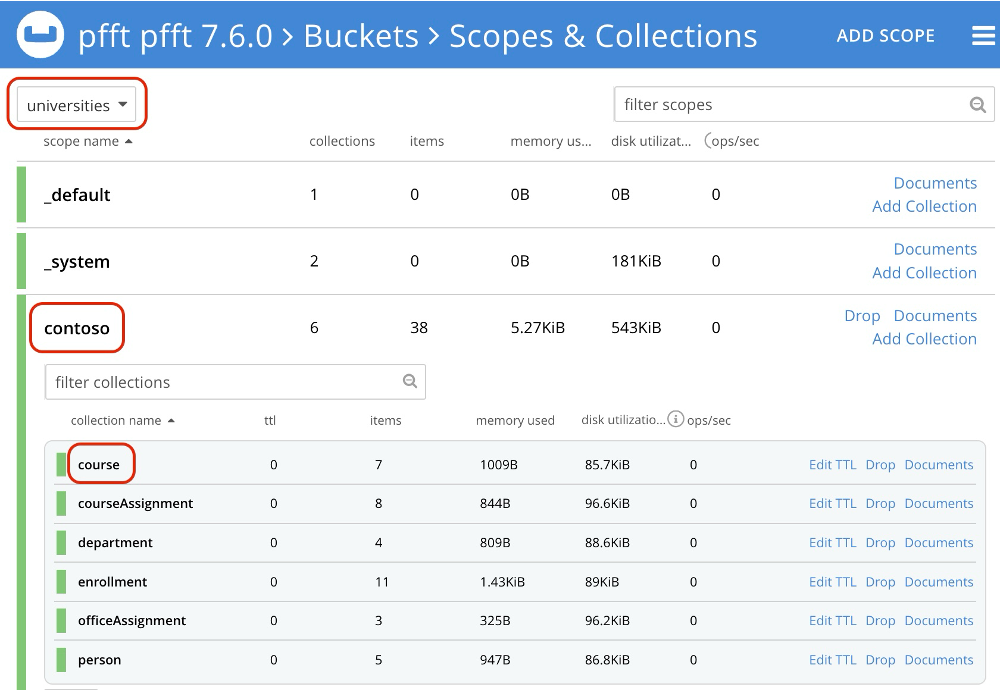

# Configuring the model with the EF Core Couchbase DB Provider

## Buckets, Scopes, Collections and Entity Types
In Couchbase DB, a Bucket is the fundamental place for storing documents. Within a Bucket, documents can be categorized hierarchically into Scopes and Collections. Scopes are a unit of tenancy, and collections are analogous to RDBMS tables. The unique combination of Bucket, Scope and Collection is referred to as a Keyspace.

When modeling for Couchbase EF Core DB Provider, we must map entities to a Keyspace. The provider allows you to do this via attributes on an entity or by using DbContext.OnModelCreated.

> [!NOTE]
> EF Core allows for default modeling where the name of the entity class will be used as the table name explicity if the class is part of a DbSet<T>. This will work for the Couchbase EF Core DB Provider as well, however, the default Scope "_default" will be used if not provided during configuration and the Collection with the same name will have to be created on the server which will match the class name as well.

Assuming we have configured a DbContext for an application such as the Contoso University Sample as follows:

```
builder.Services.AddDbContext<SchoolContext>(options=>
    options.UseCouchbase<INamedBucketProvider>(new ClusterOptions()
    .WithCredentials("Administrator", "password")
    .WithConnectionString("couchbase://localhost"),
        couchbaseDbContextOptions =>
        {
            couchbaseDbContextOptions.Bucket = "universities";
            couchbaseDbContextOptions.Scope = "contoso";
        }));
```
                                                                                                                                                                                                                                        
If the Scope has been defined in the initial configuration of the Provider, then only the Collection name is required when modeling:

```
modelBuilder.Entity<Course>().ToCouchbaseCollection("course");
```

In this case "course" is a Collection that has been created on the Couchbase Server. This will map the Course entity to the following Keyspace:

```
`universities`.`contoso`.`course`
```

In this case the Scope is "contoso" and the Collection is "course".



## Modeling more that one tenant (Scope)

Alternatively, the Scope and Collection can be defined when modeling which will override the default Scope. Assume a DbContext is configured as follows:

```
builder.Services.AddDbContext<SchoolContext>(options=>
    options.UseCouchbase<INamedBucketProvider>(new ClusterOptions()
    .WithCredentials("Administrator", "password")
    .WithConnectionString("couchbase://localhost"),
        couchbaseDbContextOptions =>
        {
            couchbaseDbContextOptions.Bucket = "universities";
        }));
```

```
modelBuilder.Entity<Course>().ToCouchbaseCollection("oxbridge", "course");
```

This will create a Keyspace that looks like this:

```
`universities`.`oxbridge`.`course`
```

In this case the Scope is "oxbridge" and the Collection is "source".


This is an example of using more than one tenant (Scope) with a single DbContext. Your use cases will dictate whether you use a single Keyspace per DbContext or multiple Keyspaces per DbContext.

> [!TIP]
> Within an application you can achieve that same multi-tenancy model by configuring more than one DbContext with different Keyspaces globally at the application level.

